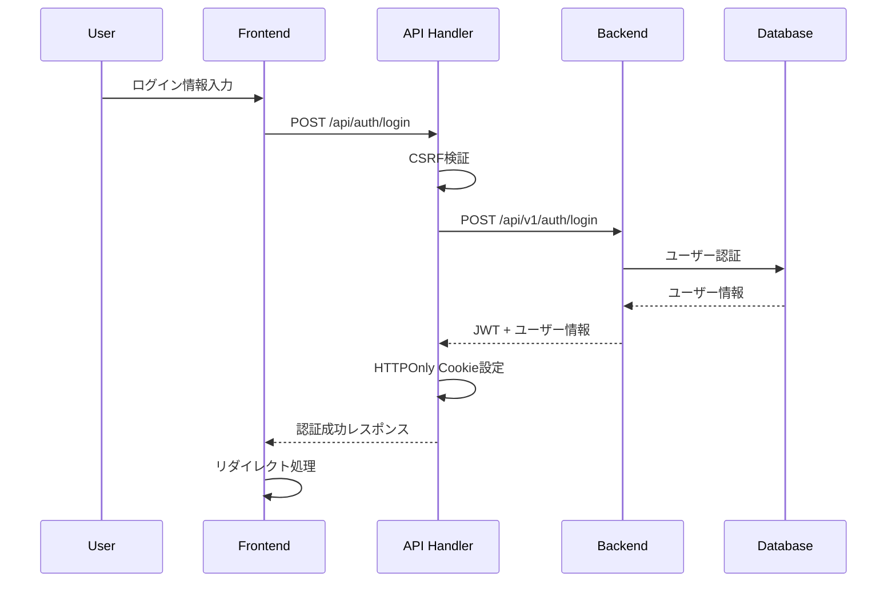

# フルスタック統合ガイド

## 概要

KOIKI-FWは、FastAPIバックエンドとNext.jsフロントエンドの完全統合を提供するフルスタックフレームワークです。このガイドでは、両層間の効率的な統合方法を説明します。

## アーキテクチャ統合

### 全体構成
```
┌─────────────────┐    ┌─────────────────┐    ┌─────────────────┐
│   Next.js       │    │   FastAPI       │    │   PostgreSQL    │
│   Frontend      │◄──►│   Backend       │◄──►│   Database      │
│   (Port 3000)   │    │   (Port 8000)   │    │   (Port 5432)   │
└─────────────────┘    └─────────────────┘    └─────────────────┘
         │                       │                       │
         └───────────────────────┼───────────────────────┘
                                 │
                    ┌─────────────────┐
                    │     Redis       │
                    │   (Port 6379)   │
                    └─────────────────┘
```

### データフロー
```
ユーザー操作
    ↓
React Component
    ↓
TanStack Query Hook
    ↓
API Route Handler (Next.js)
    ↓
FastAPI Endpoint
    ↓
Service Layer
    ↓
Repository Layer
    ↓
Database
```

## 認証統合

### Cookie認証フロー


### 実装例

#### バックエンド認証
```python
# libkoiki/api/v1/endpoints/auth.py
@router.post("/login", response_model=TokenResponse)
async def login(
    form_data: OAuth2PasswordRequestForm = Depends(),
    db: AsyncSession = Depends(get_db)
):
    user = await authenticate_user(db, form_data.username, form_data.password)
    if not user:
        raise HTTPException(status_code=401, detail="認証に失敗しました")
    
    access_token, refresh_token, expires_in = create_token_pair(user.id)
    
    return TokenResponse(
        access_token=access_token,
        refresh_token=refresh_token,
        token_type="bearer",
        expires_in=expires_in,
        user=UserResponse.from_orm(user)
    )
```

#### フロントエンド認証プロキシ
```typescript
// frontend/src/app/api/auth/login/route.ts
export async function POST(request: NextRequest) {
  // CSRF検証
  if (!validateCSRFToken(request)) {
    return createCSRFErrorResponse();
  }

  const body = await request.json();
  
  // バックエンドAPI呼び出し
  const response = await fetch(`${getBackendApiUrl()}/auth/login`, {
    method: 'POST',
    headers: { 'Content-Type': 'application/x-www-form-urlencoded' },
    body: `username=${body.email}&password=${body.password}`,
  });

  if (!response.ok) {
    return NextResponse.json(await response.json(), { status: response.status });
  }

  const data = await response.json();
  const nextResponse = NextResponse.json({ message: 'Login successful', user: data.user });

  // HTTPOnly Cookie設定
  setAccessTokenCookie(nextResponse, data.access_token);
  setRefreshTokenCookie(nextResponse, data.refresh_token);
  setCSRFTokenCookie(nextResponse, generateCSRFToken());

  return nextResponse;
}
```

## API統合パターン

### RESTful API統合

#### 1. バックエンドAPI実装
```python
# libkoiki/api/v1/endpoints/todos.py
@router.get("/", response_model=List[TodoResponse])
async def get_todos(
    skip: int = 0,
    limit: int = 100,
    current_user: User = Depends(get_current_user),
    db: AsyncSession = Depends(get_db)
):
    todos = await todo_service.get_user_todos(db, current_user.id, skip, limit)
    return [TodoResponse.from_orm(todo) for todo in todos]
```

#### 2. フロントエンドプロキシ
```typescript
// frontend/src/app/api/todos/route.ts
export async function GET(request: NextRequest) {
  const { searchParams } = new URL(request.url);
  const skip = searchParams.get('skip') || '0';
  const limit = searchParams.get('limit') || '100';

  const response = await fetch(
    `${getBackendApiUrl()}/todos?skip=${skip}&limit=${limit}`,
    {
      credentials: 'include',
      headers: getAuthHeaders(request),
    }
  );

  return NextResponse.json(await response.json(), { status: response.status });
}
```

#### 3. フロントエンドフック
```typescript
// frontend/src/hooks/use-todo-queries.ts
export function useTodos(params?: { skip?: number; limit?: number }) {
  return useQuery({
    queryKey: ['todos', params],
    queryFn: async () => {
      const searchParams = new URLSearchParams();
      if (params?.skip) searchParams.set('skip', params.skip.toString());
      if (params?.limit) searchParams.set('limit', params.limit.toString());
      
      const response = await fetch(`/api/todos?${searchParams}`);
      if (!response.ok) throw new Error('Failed to fetch todos');
      return response.json();
    },
  });
}
```

#### 4. React コンポーネント
```typescript
// frontend/src/components/tasks/task-list.tsx
export function TaskList() {
  const { data: todos, isLoading, error } = useTodos();

  if (isLoading) return <LoadingSpinner />;
  if (error) return <ErrorMessage error={error} />;

  return (
    <div className="space-y-4">
      {todos?.map((todo) => (
        <TaskItem key={todo.id} todo={todo} />
      ))}
    </div>
  );
}
```

## 型安全性統合

### 共通型定義戦略

#### バックエンド（Pydantic）
```python
# libkoiki/schemas/todo.py
class TodoBase(BaseModel):
    title: str
    description: Optional[str] = None
    is_completed: bool = False

class TodoCreate(TodoBase):
    pass

class TodoUpdate(BaseModel):
    title: Optional[str] = None
    description: Optional[str] = None
    is_completed: Optional[bool] = None

class TodoResponse(TodoBase):
    id: int
    owner_id: int
    created_at: datetime
    updated_at: datetime
    
    class Config:
        from_attributes = True
```

#### フロントエンド（TypeScript）
```typescript
// frontend/src/types/todo.ts
export interface Todo {
  id: number;
  title: string;
  description?: string;
  is_completed: boolean;
  owner_id: number;
  created_at: string;
  updated_at: string;
}

export interface TodoCreate {
  title: string;
  description?: string;
  is_completed?: boolean;
}

export interface TodoUpdate {
  title?: string;
  description?: string;
  is_completed?: boolean;
}
```

### 型同期の自動化
```bash
# スキーマ生成スクリプト（将来的な拡張）
# FastAPI OpenAPI → TypeScript型定義生成
npx openapi-typescript http://localhost:8000/openapi.json -o src/types/api.ts
```

## エラーハンドリング統合

### 統一エラーレスポンス

#### バックエンド
```python
# libkoiki/core/exceptions.py
class APIError(HTTPException):
    def __init__(self, status_code: int, message: str, code: str = None, details: dict = None):
        super().__init__(status_code=status_code, detail={
            "message": message,
            "code": code,
            "details": details or {}
        })

# 使用例
raise APIError(404, "Todo not found", "TODO_NOT_FOUND", {"todo_id": todo_id})
```

#### フロントエンド
```typescript
// frontend/src/lib/api-error.ts
export interface APIErrorResponse {
  message: string;
  code?: string;
  details?: Record<string, unknown>;
}

export class APIError extends Error {
  constructor(
    public status: number,
    public response: APIErrorResponse
  ) {
    super(response.message);
    this.name = 'APIError';
  }
}

// エラーハンドリングフック
export function useErrorHandler() {
  const addNotification = useUIStore(state => state.addNotification);

  return useCallback((error: unknown) => {
    if (error instanceof APIError) {
      addNotification({
        type: 'error',
        title: 'エラー',
        message: error.response.message,
      });
    } else {
      addNotification({
        type: 'error',
        title: 'エラー',
        message: '予期しないエラーが発生しました',
      });
    }
  }, [addNotification]);
}
```

## パフォーマンス最適化

### キャッシュ戦略

#### バックエンドキャッシュ（Redis）
```python
# libkoiki/services/todo_service.py
async def get_user_todos(
    self, 
    db: AsyncSession, 
    user_id: int, 
    skip: int = 0, 
    limit: int = 100
) -> List[TodoModel]:
    cache_key = f"user_todos:{user_id}:{skip}:{limit}"
    
    # Redis キャッシュ確認
    cached = await redis.get(cache_key)
    if cached:
        return [TodoModel.parse_raw(item) for item in json.loads(cached)]
    
    # データベースから取得
    todos = await self.todo_repository.get_by_user_id(db, user_id, skip, limit)
    
    # キャッシュに保存（5分間）
    await redis.setex(
        cache_key, 
        300, 
        json.dumps([todo.json() for todo in todos])
    )
    
    return todos
```

#### フロントエンドキャッシュ（TanStack Query）
```typescript
// frontend/src/hooks/use-todo-queries.ts
export function useTodos() {
  return useQuery({
    queryKey: ['todos'],
    queryFn: fetchTodos,
    staleTime: 5 * 60 * 1000,    // 5分間は新鮮
    cacheTime: 10 * 60 * 1000,   // 10分間キャッシュ保持
    refetchOnWindowFocus: false,  // ウィンドウフォーカス時の再取得無効
  });
}
```

### 最適化されたデータ取得

#### バックエンド（Eager Loading）
```python
# libkoiki/repositories/todo_repository.py
async def get_with_owner(self, db: AsyncSession, todo_id: int) -> Optional[TodoModel]:
    result = await db.execute(
        select(TodoModel)
        .options(selectinload(TodoModel.owner))  # Eager Loading
        .where(TodoModel.id == todo_id)
    )
    return result.scalar_one_or_none()
```

#### フロントエンド（Prefetching）
```typescript
// frontend/src/hooks/use-todo-queries.ts
export function useTodoWithPrefetch(todoId: number) {
  const queryClient = useQueryClient();

  // 関連データのプリフェッチ
  useEffect(() => {
    queryClient.prefetchQuery({
      queryKey: ['todo-comments', todoId],
      queryFn: () => fetchTodoComments(todoId),
    });
  }, [todoId, queryClient]);

  return useQuery({
    queryKey: ['todo', todoId],
    queryFn: () => fetchTodo(todoId),
  });
}
```

## 開発ワークフロー

### フルスタック機能開発手順

1. **要件定義**
   - 機能仕様の明確化
   - API設計（OpenAPI仕様）
   - UI/UXデザイン

2. **バックエンド実装**
   ```bash
   # モデル作成
   # マイグレーション
   poetry run alembic revision --autogenerate -m "Add todo model"
   poetry run alembic upgrade head
   
   # API実装
   # テスト作成
   poetry run pytest tests/test_todos.py
   ```

3. **フロントエンド実装**
   ```bash
   # 型定義作成
   # API Route Handler作成
   # フック実装
   # コンポーネント実装
   
   # テスト実行
   npm run test
   npm run lint
   ```

4. **統合テスト**
   ```bash
   # E2Eテスト
   npm run test:e2e
   
   # セキュリティテスト
   ./run_security_test.sh test
   ```

5. **デプロイ**
   ```bash
   # ステージング環境
   docker-compose -f docker-compose.staging.yml up -d
   
   # 本番環境
   docker-compose -f docker-compose.prod.yml up -d
   ```

### 開発環境セットアップ

```bash
# 1. リポジトリクローン
git clone <repository-url>
cd koiki-pyfw

# 2. バックエンド環境構築
poetry install
cp .env.example .env
# .env ファイルを編集

# 3. フロントエンド環境構築
cd frontend
npm install
cp .env.local.example .env.local
# .env.local ファイルを編集

# 4. データベース初期化
cd ..
poetry run alembic upgrade head

# 5. 開発サーバー起動
# ターミナル1: バックエンド
poetry run uvicorn app.main:app --reload

# ターミナル2: フロントエンド
cd frontend && npm run dev

# または Docker Compose使用
docker-compose up --build -d
```

## トラブルシューティング

### よくある問題と解決方法

#### CORS エラー
```python
# app/main.py
app.add_middleware(
    CORSMiddleware,
    allow_origins=["http://localhost:3000"],  # フロントエンドURL
    allow_credentials=True,
    allow_methods=["*"],
    allow_headers=["*"],
)
```

#### Cookie認証エラー
```typescript
// frontend/src/lib/cookie-api-client.ts
// SameSite設定の確認
response.cookies.set('token', value, {
  sameSite: process.env.NODE_ENV === 'production' ? 'strict' : 'lax'
});
```

#### 型不整合エラー
```bash
# バックエンドスキーマ確認
curl http://localhost:8000/openapi.json | jq '.components.schemas'

# フロントエンド型定義更新
# types/ ディレクトリの型定義を更新
```

### デバッグ方法

#### バックエンドデバッグ
```python
import structlog
logger = structlog.get_logger(__name__)

async def debug_endpoint():
    logger.debug("Debug info", user_id=user_id, data=data)
```

#### フロントエンドデバッグ
```typescript
// React Query Devtools
import { ReactQueryDevtools } from '@tanstack/react-query-devtools';

function App() {
  return (
    <>
      <YourApp />
      <ReactQueryDevtools initialIsOpen={false} />
    </>
  );
}
```