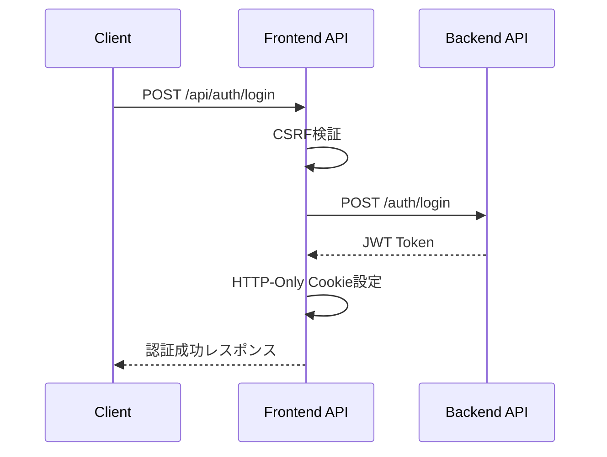

# Frontend実装詳細分析ドキュメント

## 概要

KOIKI Task Managerのフロントエンド実装について、技術面・機能面からの詳細分析と、関連するバックエンドAPI、メリット・デメリット、改善ポイントをまとめたドキュメントです。

## 技術スペック

### 基本技術スタック

| 技術 | バージョン | 用途 |
|------|-----------|------|
| Next.js | 15.5.2 | フルスタックReactフレームワーク |
| React | 19.1.0 | UIライブラリ |
| TypeScript | 5.x | 型安全な開発 |
| Tailwind CSS | 4.x | ユーティリティファーストCSS |
| Radix UI | 複数 | アクセシブルなUIコンポーネント |
| TanStack Query | 5.83.0 | サーバー状態管理 |
| Zustand | 5.0.6 | クライアント状態管理 |
| React Hook Form | 7.61.1 | フォーム管理 |
| Zod | 4.0.10 | スキーマバリデーション |
| Axios | 1.11.0 | HTTP クライアント |

### 主要依存関係の分析

#### UI/UXライブラリ
- **Radix UI**: アクセシビリティを重視したヘッドレスUIコンポーネント
- **Tailwind CSS**: カスタムデザインシステムの実装
- **Lucide React**: 一貫したアイコンライブラリ
- **class-variance-authority**: コンポーネントバリアント管理

#### 状態管理・データフェッチング
- **TanStack Query**: サーバー状態のキャッシュと同期
- **Zustand**: シンプルなクライアント状態管理
- **React Hook Form**: パフォーマンス重視のフォーム処理

## アーキテクチャ分析

### ディレクトリ構造

```
frontend/src/
├── app/                    # Next.js App Router
│   ├── api/               # API Route Handlers (プロキシ層)
│   │   ├── auth/         # 認証関連API
│   │   ├── todos/        # Todo管理API
│   │   └── users/        # ユーザー管理API
│   ├── auth/             # 認証ページ
│   ├── dashboard/        # ダッシュボード
│   ├── layout.tsx        # ルートレイアウト
│   └── page.tsx          # ホームページ
├── components/           # 再利用可能コンポーネント
│   ├── ui/              # 基本UIコンポーネント
│   ├── auth/            # 認証コンポーネント
│   ├── tasks/           # タスク管理コンポーネント
│   └── layout/          # レイアウトコンポーネント
├── hooks/               # カスタムフック
├── lib/                 # ユーティリティとライブラリ
├── stores/              # Zustand ストア
├── types/               # TypeScript型定義
└── middleware.ts        # Next.js ミドルウェア
```

### 設計パターン

#### 1. プロキシパターン (API Route Handlers)
```typescript
// frontend/src/app/api/auth/login/route.ts
export async function POST(request: NextRequest) {
  // CSRF検証
  if (!validateCSRFToken(request)) {
    return createCSRFErrorResponse();
  }

  // バックエンドAPIへプロキシ
  const response = await fetch(`${getBackendApiUrl()}/auth/login`, {
    method: 'POST',
    headers: { 'Content-Type': 'application/x-www-form-urlencoded' },
    body: `username=${body.email}&password=${body.password}`,
  });

  // Cookie設定とレスポンス返却
  if (data.access_token) {
    setAccessTokenCookie(nextResponse, data.access_token);
  }
}
```

#### 2. カスタムフックパターン
```typescript
// React Query を使った認証状態管理
export function useCookieAuth() {
  const { data: user, isLoading, error } = useCookieMe();
  
  return {
    user,
    isAuthenticated: !!user,
    isLoading,
    error,
  };
}
```

#### 3. コンポーネント合成パターン
```typescript
// 再利用可能なUIコンポーネント
export function Card({ className, ...props }: CardProps) {
  return (
    <div className={cn("rounded-lg border bg-card text-card-foreground shadow-sm", className)} {...props} />
  );
}
```

## 機能面の詳細分析

### 1. 認証システム

#### Cookie-based認証フロー


#### セキュリティ機能
- **HTTPOnly Cookie**: XSS攻撃からトークンを保護
- **CSRF Protection**: トークンベースの保護
- **ミドルウェア認証**: 保護されたルートへのアクセス制御

```typescript
// middleware.ts - 認証チェック
export function middleware(request: NextRequest) {
  const isProtectedRoute = PROTECTED_ROUTES.some(route =>
    pathname.startsWith(route)
  );

  if (isProtectedRoute) {
    const token = request.cookies.get(AUTH_TOKEN_COOKIE)?.value;
    if (!token || !isValidJWTFormat(token)) {
      return NextResponse.redirect(new URL(LOGIN_PATH, request.url));
    }
  }
}
```

### 2. タスク管理システム

#### 主要機能
- **CRUD操作**: 作成、読取、更新、削除
- **リアルタイム検索**: タイトル・説明文での検索
- **ステータスフィルタ**: 完了/未完了でのフィルタリング
- **統計表示**: タスクの完了状況統計

#### データフロー
```typescript
// React Query を使った楽観的更新
const updateTaskMutation = useCookieUpdateTodo();

const handleToggleComplete = async (todo: TodoResponse) => {
  try {
    await updateTaskMutation.mutateAsync({
      id: todo.id,
      data: { is_completed: !todo.is_completed }
    });
    // 成功時の通知
  } catch {
    // エラーハンドリング
  }
};
```

### 3. UI/UXシステム

#### コンポーネント階層
- **Layout Components**: 全体レイアウト、ダッシュボードレイアウト
- **Form Components**: ログイン、登録、タスク作成フォーム
- **Data Display**: タスクリスト、統計カード
- **Feedback**: トースト通知、ローディング状態

#### デザインシステム
```typescript
// Tailwind + CVA を使ったバリアント管理
const buttonVariants = cva(
  "inline-flex items-center justify-center rounded-md text-sm font-medium",
  {
    variants: {
      variant: {
        default: "bg-primary text-primary-foreground hover:bg-primary/90",
        destructive: "bg-destructive text-destructive-foreground hover:bg-destructive/90",
      },
      size: {
        default: "h-10 px-4 py-2",
        sm: "h-9 rounded-md px-3",
      },
    },
  }
);
```

## バックエンドAPI連携

### 認証API群

| エンドポイント | メソッド | 機能 | フロントエンド実装 |
|---------------|---------|------|------------------|
| `/auth/login` | POST | ログイン | `/api/auth/login/route.ts` |
| `/auth/logout` | POST | ログアウト | `/api/auth/logout/route.ts` |
| `/auth/register` | POST | ユーザー登録 | `/api/auth/register/route.ts` |
| `/auth/me` | GET | 現在のユーザー情報 | `/api/auth/me/route.ts` |
| `/auth/refresh` | POST | トークン更新 | `/api/auth/refresh/route.ts` |

### Todo API群

| エンドポイント | メソッド | 機能 | フロントエンド実装 |
|---------------|---------|------|------------------|
| `/todos` | GET | Todo一覧取得 | `/api/todos/route.ts` |
| `/todos` | POST | Todo作成 | `/api/todos/route.ts` |
| `/todos/{id}` | GET | Todo詳細取得 | `/api/todos/[id]/route.ts` |
| `/todos/{id}` | PUT | Todo更新 | `/api/todos/[id]/route.ts` |
| `/todos/{id}` | DELETE | Todo削除 | `/api/todos/[id]/route.ts` |

### User API群

| エンドポイント | メソッド | 機能 | フロントエンド実装 |
|---------------|---------|------|------------------|
| `/users/me` | GET | 自分の情報取得 | `/api/users/me/route.ts` |
| `/users/me` | PUT | 自分の情報更新 | `/api/users/me/route.ts` |
| `/users` | GET | ユーザー一覧 | `/api/users/route.ts` |
| `/users/{id}` | GET | ユーザー詳細 | `/api/users/[id]/route.ts` |

### API通信アーキテクチャ

#### プロキシレイヤーの実装
```typescript
// Cookie-based API Client
class CookieApiClient {
  async fetchWithCredentials(url: string, options: RequestInit = {}): Promise<Response> {
    return fetch(url, {
      ...options,
      credentials: 'include', // Cookie自動送信
      headers: {
        ...this.getHeaders(),
        ...options.headers,
      },
    });
  }

  private getHeaders(): HeadersInit {
    const headers: HeadersInit = { 'Content-Type': 'application/json' };
    
    // CSRF トークンを追加
    if (this.csrfToken) {
      headers['x-csrf-token'] = this.csrfToken;
    }
    
    return headers;
  }
}
```

## メリット・デメリット分析

### メリット

#### 技術選択の利点

1. **Next.js 15 App Router**
   - サーバーサイドレンダリングによるSEO最適化
   - ファイルベースルーティング
   - 内蔵のAPI Route Handlers

2. **Cookie-based認証**
   - XSS攻撃に対する高い耐性 (HTTPOnly Cookie)
   - CSRF保護の実装
   - ブラウザの自動Cookie管理

3. **React Query + Zustand**
   - サーバー状態とクライアント状態の明確な分離
   - 楽観的更新とエラーハンドリング
   - キャッシュ戦略とデータ同期

4. **TypeScript + Zod**
   - コンパイル時の型安全性
   - ランタイムバリデーション
   - 開発体験の向上

5. **Radix UI + Tailwind**
   - アクセシビリティの標準対応
   - カスタマイズ可能なデザインシステム
   - 一貫したユーザー体験

#### セキュリティ面の利点

1. **多層防御戦略**
   - ミドルウェアレベルでの認証チェック
   - CSRF保護
   - HTTPOnly Cookie使用

2. **プロキシパターンによる分離**
   - フロントエンドとバックエンドの疎結合
   - セキュリティレイヤーの集約

### デメリット

#### 技術的制約

1. **Cookie依存の制約**
   - モバイルアプリでの実装複雑性
   - サードパーティAPIとの統合制約
   - CORS設定の複雑さ

2. **Next.js App Routerの学習コストの高さ**
   - 従来のPages Routerとの差異
   - サーバーコンポーネントとクライアントコンポーネントの使い分け

3. **プロキシレイヤーの複雑性**
   - Route Handlersでの重複処理
   - エラーハンドリングの複雑さ
   - デバッグの難しさ

#### パフォーマンス面の課題

1. **バンドルサイズの大きさ**
   - 多数のUIライブラリ依存
   - Radix UIの重いコンポーネント

2. **API呼び出しのオーバーヘッド**
   - プロキシレイヤーによる遅延
   - 重複するリクエスト処理

#### 開発・運用面の課題

1. **状態管理の複雑性**
   - React Query とZustandの役割分担
   - キャッシュ戦略の設計

2. **型定義の維持コスト**
   - バックエンドAPIとの型同期
   - 複数の型定義ファイル管理

## 改善ポイント

### 1. セキュリティ強化

#### 現在の実装課題
```typescript
// 問題: CSRFトークンの生成方法
export function generateCSRFToken(): string {
  if (typeof crypto !== 'undefined' && crypto.getRandomValues) {
    const bytes = new Uint8Array(CSRF_CONFIG.TOKEN_LENGTH);
    crypto.getRandomValues(bytes);
    return Array.from(bytes, b => b.toString(16).padStart(2, '0')).join('');
  }
  return randomBytes(CSRF_CONFIG.TOKEN_LENGTH).toString('hex');
}
```

#### 改善案
1. **セキュリティヘッダーの強化**
```typescript
// next.config.ts への追加
async headers() {
  return [
    {
      source: '/(.*)',
      headers: [
        { key: 'X-Frame-Options', value: 'DENY' },
        { key: 'X-Content-Type-Options', value: 'nosniff' },
        { key: 'Referrer-Policy', value: 'origin-when-cross-origin' },
        { key: 'Permissions-Policy', value: 'camera=(), microphone=(), geolocation=()' },
      ],
    },
  ];
}
```

2. **Content Security Policy (CSP) の実装**
```typescript
const cspHeader = `
  default-src 'self';
  script-src 'self' 'unsafe-eval' 'unsafe-inline';
  style-src 'self' 'unsafe-inline';
  img-src 'self' blob: data:;
  font-src 'self';
  object-src 'none';
  base-uri 'self';
  form-action 'self';
  frame-ancestors 'none';
  upgrade-insecure-requests;
`;
```

3. **レート制限の実装**
```typescript
// middleware.ts への追加
const rateLimiter = new Map();

function checkRateLimit(ip: string, endpoint: string): boolean {
  const key = `${ip}:${endpoint}`;
  const now = Date.now();
  const windowMs = 15 * 60 * 1000; // 15分
  const maxRequests = endpoint.includes('/auth/') ? 5 : 100;
  
  // レート制限ロジック実装
  return true; // 簡略化
}
```

### 2. パフォーマンス最適化

#### バンドルサイズ最適化
```typescript
// 動的インポートによるコード分割
const TaskCreateDialog = dynamic(() => import('./task-create-dialog'), {
  loading: () => <p>Loading...</p>
});

// Tree-shakingの活用
import { Button } from '@/components/ui/button';
// ✗ import * as RadixUI from '@radix-ui/react-dialog';
```

#### React Query設定の最適化
```typescript
// より効率的なキャッシュ戦略
const queryClient = new QueryClient({
  defaultOptions: {
    queries: {
      staleTime: 5 * 60 * 1000, // 5分
      gcTime: 10 * 60 * 1000, // 10分
      refetchOnWindowFocus: false,
      retry: (failureCount, error) => {
        // スマートなリトライ戦略
        return failureCount < 3 && !isClientError(error);
      },
    },
  },
});
```

### 3. 開発体験向上

#### 型安全性の強化
```typescript
// API レスポンス型の自動生成
import type { paths } from '@/types/api-schema'; // OpenAPI自動生成

type TodoResponse = paths['/todos']['get']['responses']['200']['content']['application/json'];
```

#### エラーハンドリングの統一化
```typescript
// グローバルエラーハンドラー
class APIError extends Error {
  constructor(
    public status: number,
    public code: string,
    message: string
  ) {
    super(message);
  }
}

// React Query エラーハンドリング
const defaultMutationOptions = {
  onError: (error: APIError) => {
    if (error.status === 401) {
      // 認証エラー処理
      queryClient.clear();
      router.push('/auth/login');
    } else {
      // 一般的なエラー通知
      toast.error(error.message);
    }
  },
};
```

### 4. 監視・ログ機能の強化

#### フロントエンド監視
```typescript
// エラートラッキング
function setupErrorTracking() {
  window.addEventListener('error', (event) => {
    // エラーログの送信
    console.error('Global error:', event.error);
  });

  window.addEventListener('unhandledrejection', (event) => {
    // Promise rejection の処理
    console.error('Unhandled promise rejection:', event.reason);
  });
}
```

#### パフォーマンス監視
```typescript
// Web Vitals の計測
import { getCLS, getFID, getFCP, getLCP, getTTFB } from 'web-vitals';

function sendToAnalytics(metric: Metric) {
  // メトリクスの送信処理
  console.log(metric);
}

getCLS(sendToAnalytics);
getFID(sendToAnalytics);
getFCP(sendToAnalytics);
getLCP(sendToAnalytics);
getTTFB(sendToAnalytics);
```

### 5. テスト戦略の改善

#### ユニットテスト
```typescript
// Jest + Testing Library
import { render, screen, fireEvent } from '@testing-library/react';
import { LoginForm } from '@/components/auth/login-form';

test('should handle login form submission', async () => {
  render(<LoginForm />);
  
  fireEvent.change(screen.getByLabelText(/email/i), {
    target: { value: 'test@example.com' }
  });
  
  fireEvent.click(screen.getByRole('button', { name: /sign in/i }));
  
  // アサーション
});
```

#### E2Eテスト
```typescript
// Playwright
import { test, expect } from '@playwright/test';

test('user can login and create todo', async ({ page }) => {
  await page.goto('/auth/login');
  await page.fill('[data-testid=email]', 'test@example.com');
  await page.fill('[data-testid=password]', 'password');
  await page.click('[data-testid=login-button]');
  
  await expect(page).toHaveURL('/dashboard');
  
  // Todo作成のテスト
  await page.click('[data-testid=create-todo-button]');
  await page.fill('[data-testid=todo-title]', 'Test Todo');
  await page.click('[data-testid=save-todo-button]');
  
  await expect(page.locator('[data-testid=todo-item]')).toContainText('Test Todo');
});
```

## 実装優先度

### 高優先度 (即座に対応すべき)
1. **セキュリティヘッダーの追加**
2. **CSP の実装**
3. **エラーハンドリングの統一化**
4. **基本的なユニットテストの実装**

### 中優先度 (短期的に対応)
1. **バンドルサイズの最適化**
2. **レート制限の実装**
3. **監視機能の追加**
4. **型定義の自動生成**

### 低優先度 (長期的に検討)
1. **モバイル対応の検討**
2. **PWA化**
3. **国際化 (i18n) 対応**
4. **アクセシビリティ監査と改善**

## まとめ

この実装は、モダンなWeb開発のベストプラクティスを多く取り入れた、セキュアで保守性の高いフロントエンドアプリケーションです。特にCookie-based認証とCSRF保護により、高いセキュリティレベルを実現しています。

一方で、プロキシレイヤーの複雑性やバンドルサイズの大きさなど、改善の余地も存在します。提案した改善点を段階的に実装することで、より堅牢で効率的なシステムに発展させることができるでしょう。

技術選択は総じて適切であり、スケーラブルで保守性の高いアーキテクチャが構築されています。継続的な改善により、さらに優れたユーザー体験と開発体験を提供できるポテンシャルを持っています。
